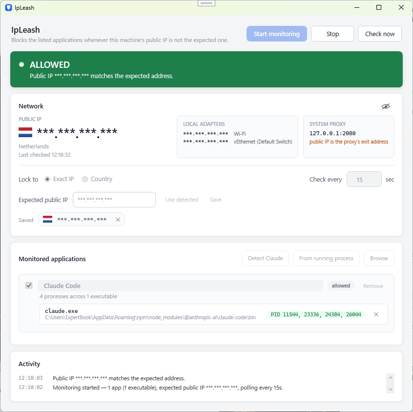

# IpLeash

A WPF desktop app that cuts a list of Windows applications off from the network whenever the
machine's public IP is not the one you expect.

The intended use is a VPN kill-switch: if the tunnel drops and your WAN IP reverts to your ISP
address, every monitored app stops talking to the internet until the expected IP is back.



## Requirements

- Windows 10/11
- .NET 9 desktop runtime (or the SDK)
- **Administrator rights** — creating firewall rules requires them, so the app is manifested
  `requireAdministrator` and prompts for UAC at launch.

## Build and run

From the repository root:

```powershell
dotnet build
.\src\IpLeash\bin\Debug\net9.0-windows\IpLeash.exe
```

## Behaviour worth knowing

The window shows the rest. These are the decisions you cannot see by looking at it:

- **Fail closed.** If the public IP cannot be read at all, that is treated as a mismatch and the
  blocks go on. A kill-switch that opens up when it loses confidence is not a kill-switch.
- **One global expected IP** drives every decision, and only the public/WAN IP does — the local
  adapter list is information, not input.
- **Reaction is immediate on any network address change**, not just on the poll interval.
- **Closing the window does not quit.** It hides to the notification area and enforcement carries
  on; a balloon tip says so the first time. **Exit lives only in the tray menu** and is the single
  path that ends enforcement — when something is blocked it names what is about to be released
  first, because that is the one consequential, easy-to-do-by-accident action in the app.
- **Only one instance ever runs.** A second launch surfaces the first window and exits, so
  re-running the exe is a fine way to reopen from the tray. This is not a nicety: a second
  instance's startup cleanup would delete the first's *active* rules, silently unblocking apps
  while the first window still read BLOCKED.
- **The list is editable only while stopped.** Reconciling rules mid-flight buys nothing.
- **The proxy panel warns only when a proxy actually affects the measurement.** A proxy that is
  configured but bypassed for the probe host leaves the reading genuinely yours.

The tray icon is grey when not monitoring, green when the IP matches, red when something is
blocked, and amber when the IP is unknown and blocking fail-closed. Hovering shows the same in
words.

> On Windows 11 a newly registered tray icon starts in the **overflow flyout** behind the `^`
> chevron. Drag it out, or pin it via Settings → Personalization → Taskbar → Other system tray
> icons.

## How the block works

Two rules per executable, sharing one name:

```
netsh advfirewall firewall add rule name="<RULE>" dir=out action=block program="<exe>" enable=yes profile=any
netsh advfirewall firewall add rule name="<RULE>" dir=in  action=block program="<exe>" enable=yes profile=any
```

`<RULE>` is `IpLeash Block - <file name> [<8 hex>]`, where the hex is a hash of the full,
normalized path. The name keeps it readable in `wf.msc`; the hash keeps it unique, because a list
can hold two installs of the same executable name — an npm `claude.exe` and a native `claude.exe`
would otherwise collide on one rule.

Windows Firewall gives block rules precedence over allow rules, so this works even if the
application already has allow rules of its own. netsh output is localized, so success is decided
purely by exit code — the text is never parsed.

**Executables are screened before a rule is written.** netsh happily accepts a rule pointing at a
`.cmd` launcher or a missing file, reports success, and blocks nothing. A silent no-op is the
worst outcome for a kill-switch, so every candidate must exist, end in `.exe`, and start with the
`MZ` DOS signature. Executables that go missing later are flagged in red on their row.

**Crash recovery.** Rules are removed on exit, but a crash cannot run cleanup code. Active block
paths are recorded in `%LOCALAPPDATA%\IpLeash\active-block.json`; on startup that file is read and
the corresponding rules deleted, so a killed process can never leave an app blocked forever.

## Known limitations

- **Established connections may survive.** Windows Firewall applies rules to new connections; a
  TCP session already open when the rule lands can persist. A guaranteed instant cut requires
  killing the process, which this app deliberately does not do.
- **The rule binds to an executable, not a process tree.** Blocking `claude.exe` stops its own
  traffic, but a `git.exe` or `node.exe` it spawns is a separate image and keeps its access.
- **Launcher scripts cannot be blocked.** If your target is `python script.py` or a `.bat`, you
  must point at the `.exe` it starts — which then blocks *every* use of that interpreter.
- **Fail-closed can produce a spurious block** if all three public-IP providers are unreachable at
  once. Three independent providers make this rare, and every occurrence is logged.
- **Some processes cannot be picked.** Protected and system processes do not expose their image
  path; they appear greyed out in the picker, since a rule needs a path.
- **With a proxy in the path, the expected IP is the proxy's, not the machine's.** IpLeash measures
  its own egress. If a monitored application routes differently, the address being compared is not
  the one that application exits from.

## Architecture

Strict MVVM, .NET 9, two Microsoft packages (`CommunityToolkit.Mvvm`,
`Microsoft.Extensions.DependencyInjection`).

```
src/IpLeash/
  App.xaml.cs            composition root; single-instance mutex, startup cleanup, teardown
  Models/                settings and snapshot types
  Services/              one interface + one implementation each
    MonitorEngine.cs       the state machine: poll -> decide -> reconcile
    FirewallService.cs     netsh add/delete/show, exit-code driven
    AppDiscoveryService.cs Claude Code / Claude Desktop location probing
    ProcessWatcher.cs      per-path PID matching + running-executable enumeration
    PublicIpService.cs     three providers, 5 s timeout each
    ProxyService.cs        WinINET registry + env vars + effective proxy for the probe URL
    LocalIpService.cs      adapter enumeration
    ExecutableFile.cs      .exe + MZ screening
    SettingsStore.cs       JSON settings, tolerant of a corrupt file
    BlockStateStore.cs     crash-recovery record
  ViewModels/            no WPF types, not even ICollectionView
  Views/                 MainWindow, ProcessPickerWindow (+ empty code-behinds), Converters/
    Styles/Theme.xaml    every colour, radius, font and control template
```

The rules the code is held to:

- Both windows' code-behind contain `InitializeComponent()` and nothing else; the XAML has no
  event handlers. Dialogs close via the `DialogCloser` attached property.
- `Closing` is subscribed in `App`, not in the window. Hiding versus quitting is a lifetime
  decision, and lifetime belongs to the composition root.
- `MonitorEngine` has no UI awareness. It uses `System.Timers.Timer`, not `DispatcherTimer`, so it
  is never pinned to the UI thread; the ViewModel marshals via a captured `SynchronizationContext`.
- Evaluation is serialized by a `SemaphoreSlim`, because the poll timer and `NetworkAddressChanged`
  can otherwise fire together and issue conflicting netsh calls.
- Every service sits behind an interface, so the engine can be tested without a firewall or a
  network.
- Views never spell out a colour; buttons and text inputs are templated rather than restyled,
  since the stock WPF chrome has a gradient and a 3 px corner no property setter removes.
- **Lists are a `ScrollViewer` plus an `ItemsControl`, never a `ListBox`.** A ListBox measures
  items against infinite width, which silently disables `TextWrapping` and star-sized columns —
  long text then clips mid-word instead of wrapping. That is a real hazard for the activity log,
  whose most important messages (`FAILED TO BLOCK …`) are also its longest.
- `Assets/*.ico` are generated: one mark in five colours at 16/24/32/48/64 px, as 32bpp DIBs
  rather than PNG-in-ICO — GDI+ cannot rasterise PNG frames, and `NotifyIcon` takes a
  `System.Drawing.Icon`, so a PNG-framed file loads without error and then shows no tray image.
